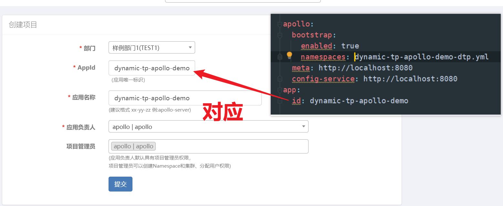
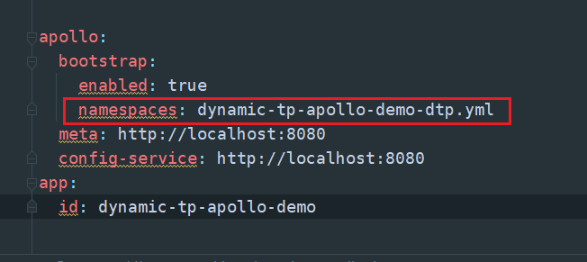
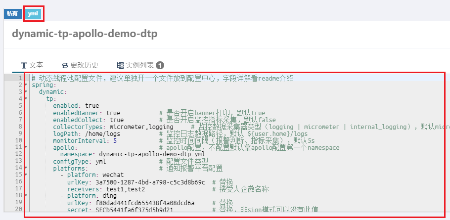

::: tip 

1. 动态线程池配置文件，建议单独开一个文件放到 apollo 中，如：user-center-dtp-dev.yml

2. 如果配置中心支持 yml 格式，建议最好使用 yml 文件配置，可读性、可操作性更友好

3. 给出的是全配置项，使用不到的项或者使用默认值的项都可以删除，减少配置量

4. 集成失败 90% 以上情况都是使用姿势有误 / 版本兼容问题，有版本兼容性问题可以提 Issues 或加群反馈

:::

::: danger

1. 下述配置项的值都是随便填写的，请不要直接使用该值，根据自己项目做调整

:::

### maven依赖

SpringBoot1x、2x 用此依赖

 ```xml
 <dependency>
     <groupId>org.dromara.dynamictp</groupId>
     <artifactId>dynamic-tp-spring-boot-starter-apollo</artifactId>
     <version>1.2.0</version>
 </dependency>
 ```
SpringBoot3x 用此依赖

 ```xml
 <dependency>
     <groupId>org.dromara.dynamictp</groupId>
     <artifactId>dynamic-tp-spring-boot-starter-apollo</artifactId>
     <version>1.2.0-x</version>
 </dependency>
 ```

### 线程池配置文件

#### yml 格式

```yaml 
dynamictp:
  enabled: true                               # 是否启用 dynamictp，默认true
  enabledCollect: true                        # 是否开启监控指标采集，默认true
  collectorTypes: micrometer,logging          # 监控数据采集器类型（logging | micrometer | internal_logging | JMX），默认micrometer
  logPath: /home/logs/dynamictp/user-center/  # 监控日志数据路径，默认 ${user.home}/logs，采集类型非logging不用配置
  monitorInterval: 5                          # 监控时间间隔（报警检测、指标采集），默认5s
  
  # 告警渠道
  platforms:                                  # 通知报警平台配置
    - platform: wechat
      platformId: 1                            # 平台id，自定义
      urlKey: 3a700-127-4bd-a798-c53d8b69c     # webhook 中的 key
      receivers: test1,test2                   # 接受人企微账号

    - platform: ding
      platformId: 2                            # 平台id，自定义
      urlKey: f80dad441fcd655438f4a08dcd6a     # webhook 中的 access_token
      secret: SECb5441fa6f375d5b9d21           # 安全设置在验签模式下才的秘钥，非验签模式没有此值
      receivers: 18888888888                   # 钉钉账号手机号

    - platform: lark
      platformId: 3
      urlKey: 0d944ae7-b24a-40                 # webhook 中的 token
      secret: 3a750012874bdac5c3d8b69c         # 安全设置在签名校验模式下才的秘钥，非验签模式没有此值
      receivers: test1,test2                   # 接受人username / openid

    - platform: email
      platformId: 4
      receivers: 123456@qq.com,789789@qq.com   # 收件人邮箱，多个用逗号隔开
  
  # 全局配置    
  globalExecutorProps:                        # 线程池配置 > 全局配置 > 字段默认值
    rejectedHandlerType: CallerRunsPolicy
    queueType: VariableLinkedBlockingQueue
    waitForTasksToCompleteOnShutdown: true
    awaitTerminationSeconds: 3
    taskWrapperNames: ["swTrace", "ttl", "mdc"]
    queueTimeout: 300
    runTimeout: 300
    notifyItems:                     # 报警项，不配置自动会按默认值（查看源码NotifyItem类）配置（变更通知、容量报警、活性报警、拒绝报警、任务超时报警）
      - type: change
        enabled: true
    
      - type: capacity               # 队列容量使用率，报警项类型，查看源码 NotifyTypeEnum枚举类
        enabled: true
        threshold: 80                # 报警阈值，默认70，意思是队列使用率达到70%告警
        platformIds: [2]             # 可选配置，本配置优先级 > 所属线程池platformIds > 全局配置platforms
        interval: 120                # 报警间隔（单位：s），默认120
    
      - type: liveness               # 线程池活性
        enabled: true
        threshold: 80                # 报警阈值，默认 70，意思是活性达到70%告警
    
      - type: reject                 # 触发任务拒绝告警
        enabled: true
        threshold: 100               # 默认阈值10
    
      - type: run_timeout            # 任务执行超时告警
        enabled: true
        threshold: 100               # 默认阈值10
    
      - type: queue_timeout          # 任务排队超时告警
        enabled: true
        threshold: 100               # 默认阈值10
  
  # 线程池配置      
  executors:                               # 动态线程池配置，都有默认值，采用默认值的可以不配置该项，减少配置量
    - threadPoolName: dtpExecutor1         # 线程池名称，必填
      threadPoolAliasName: 测试线程池        # 线程池别名，可选
      executorType: common                 # 线程池类型 common、eager、ordered、scheduled、priority，默认 common
      corePoolSize: 6                      # 核心线程数，默认1
      maximumPoolSize: 8                   # 最大线程数，默认cpu核数
      queueCapacity: 2000                  # 队列容量，默认1024
      queueType: VariableLinkedBlockingQueue         # 任务队列，查看源码QueueTypeEnum枚举类，默认VariableLinkedBlockingQueue
      rejectedHandlerType: CallerRunsPolicy          # 拒绝策略，查看RejectedTypeEnum枚举类，默认AbortPolicy
      keepAliveTime: 60                              # 空闲线程等待超时时间，默认60
      threadNamePrefix: test                         # 线程名前缀，默认dtp
      allowCoreThreadTimeOut: false                  # 是否允许核心线程池超时，默认false
      waitForTasksToCompleteOnShutdown: true         # 参考spring线程池设计，优雅关闭线程池，默认true
      awaitTerminationSeconds: 5                     # 优雅关闭线程池时，阻塞等待线程池中任务执行时间，默认3，单位（s）
      preStartAllCoreThreads: false                  # 是否预热所有核心线程，默认false
      runTimeout: 200                                # 任务执行超时阈值，单位（ms），默认0（不统计）
      queueTimeout: 100                              # 任务在队列等待超时阈值，单位（ms），默认0（不统计）
      taskWrapperNames: ["ttl", "mdc"]               # 任务包装器名称，继承TaskWrapper接口
      notifyEnabled: true                            # 是否开启报警，默认true
      platformIds: [1,2]                             # 报警平台id，不配置默认拿上层platforms配置的所有平台
```

#### properties 格式

```properties
dynamictp.enabled=true                                  # 是否启用 dynamictp，默认true
dynamictp.enabledCollect=true                           # 是否开启监控指标采集，默认true
dynamictp.collectorTypes=micrometer,logging             # 监控数据采集器类型（logging | micrometer | internal_logging | JMX），默认micrometer
dynamictp.logPath=/home/logs/dynamictp/user-center/    # 监控日志数据路径，默认 ${user.home}/logs，采集类型非logging不用配置
dynamictp.monitorInterval=5                             # 监控时间间隔（报警检测、指标采集），默认5s

# 告警渠道
dynamictp.platforms[0].platform=wechat                  # 第一个通知平台为微信
dynamictp.platforms[0].platformId=1                     # 平台id，自定义
dynamictp.platforms[0].urlKey=3a700-127-4bd-a798-c53d8b69c # webhook 中的 key
dynamictp.platforms[0].receivers=test1,test2            # 接受人企微账号

dynamictp.platforms[1].platform=ding                    # 第二个通知平台为钉钉
dynamictp.platforms[1].platformId=2                     # 平台id，自定义
dynamictp.platforms[1].urlKey=f80dad441fcd655438f4a08dcd6a # webhook 中的 access_token
dynamictp.platforms[1].secret=SECb5441fa6f375d5b9d21    # 安全设置在验签模式下才的秘钥，非验签模式没有此值
dynamictp.platforms[1].receivers=18888888888            # 钉钉账号手机号

dynamictp.platforms[2].platform=lark                    # 第三个通知平台为飞书
dynamictp.platforms[2].platformId=3                     # 平台id，自定义
dynamictp.platforms[2].urlKey=0d944ae7-b24a-40          # webhook 中的 token
dynamictp.platforms[2].secret=3a750012874bdac5c3d8b69c  # 安全设置在签名校验模式下才的秘钥，非验签模式没有此值
dynamictp.platforms[2].receivers=test1,test2            # 接受人username / openid

dynamictp.platforms[3].platform=email                   # 第四个通知平台为邮件
dynamictp.platforms[3].platformId=4                     # 平台id，自定义
dynamictp.platforms[3].receivers=123456@qq.com,789789@qq.com # 收件人邮箱，多个用逗号隔开

# 全局配置    
dynamictp.globalExecutorProps.rejectedHandlerType=CallerRunsPolicy
dynamictp.globalExecutorProps.queueType=VariableLinkedBlockingQueue
dynamictp.globalExecutorProps.waitForTasksToCompleteOnShutdown=true
dynamictp.globalExecutorProps.awaitTerminationSeconds=3
dynamictp.globalExecutorProps.taskWrapperNames=swTrace,ttl,mdc
dynamictp.globalExecutorProps.queueTimeout=300
dynamictp.globalExecutorProps.runTimeout=300
dynamictp.globalExecutorProps.notifyItems[0].type=change
dynamictp.globalExecutorProps.notifyItems[0].enabled=true

dynamictp.globalExecutorProps.notifyItems[1].type=capacity
dynamictp.globalExecutorProps.notifyItems[1].enabled=true
dynamictp.globalExecutorProps.notifyItems[1].threshold=80
dynamictp.globalExecutorProps.notifyItems[1].platformIds=2
dynamictp.globalExecutorProps.notifyItems[1].interval=120

dynamictp.globalExecutorProps.notifyItems[2].type=liveness
dynamictp.globalExecutorProps.notifyItems[2].enabled=true
dynamictp.globalExecutorProps.notifyItems[2].threshold=80

dynamictp.globalExecutorProps.notifyItems[3].type=reject
dynamictp.globalExecutorProps.notifyItems[3].enabled=true
dynamictp.globalExecutorProps.notifyItems[3].threshold=100

dynamictp.globalExecutorProps.notifyItems[4].type=run_timeout
dynamictp.globalExecutorProps.notifyItems[4].enabled=true
dynamictp.globalExecutorProps.notifyItems[4].threshold=100

dynamictp.globalExecutorProps.notifyItems[5].type=queue_timeout
dynamictp.globalExecutorProps.notifyItems[5].enabled=true
dynamictp.globalExecutorProps.notifyItems[5].threshold=100

# 线程池配置      
dynamictp.executors[0].threadPoolName=dtpExecutor1         # 线程池名称，必填
dynamictp.executors[0].threadPoolAliasName=测试线程池        # 线程池别名，可选
dynamictp.executors[0].executorType=common                 # 线程池类型 common、eager、ordered、scheduled、priority，默认 common
dynamictp.executors[0].corePoolSize=6                      # 核心线程数，默认1
dynamictp.executors[0].maximumPoolSize=8                   # 最大线程数，默认cpu核数
dynamictp.executors[0].queueCapacity=2000                  # 队列容量，默认1024
dynamictp.executors[0].queueType=VariableLinkedBlockingQueue         # 任务队列，查看源码QueueTypeEnum枚举类，默认VariableLinkedBlockingQueue
dynamictp.executors[0].rejectedHandlerType=CallerRunsPolicy          # 拒绝策略，查看RejectedTypeEnum枚举类，默认AbortPolicy
dynamictp.executors[0].keepAliveTime=60                              # 空闲线程等待超时时间，默认60
dynamictp.executors[0].threadNamePrefix=test                         # 线程名前缀，默认dtp
dynamictp.executors[0].allowCoreThreadTimeOut=false                  # 是否允许核心线程池超时，默认false
dynamictp.executors[0].waitForTasksToCompleteOnShutdown=true         # 参考spring线程池设计，优雅关闭线程池，默认true
dynamictp.executors[0].awaitTerminationSeconds=5                     # 优雅关闭线程池时，阻塞等待线程池中任务执行时间，默认3，单位（s）
dynamictp.executors[0].preStartAllCoreThreads=false                  # 是否预热所有核心线程，默认false
dynamictp.executors[0].runTimeout=200                                # 任务执行超时阈值，单位（ms），默认0（不统计）
dynamictp.executors[0].queueTimeout=100                              # 任务在队列等待超时阈值，单位（ms），默认0（不统计）
dynamictp.executors[0].taskWrapperNames=ttl,mdc                      # 任务包装器名称，继承TaskWrapper接口
dynamictp.executors[0].notifyEnabled=true                            # 是否开启报警，默认true
dynamictp.executors[0].platformIds=1,2
```

### application.yml 配置

```yaml
apollo:
  bootstrap:
    enabled: true
    namespaces: user-center-dev.yml,user-center-dtp-dev.yml  # 注意：这里要加上动态线程池配置文件，服务启动会根据此配置拉取配置	
  meta: http://localhost:8080
  config-service: http://localhost:8080
app:
  id: user-center
```

::: warning

如果 Apollo 使用 docker 方式安装，需要更改配置，参考这篇文章：https://blog.csdn.net/qq_35530042/article/details/113985623

docker 方式安装请参考这篇文章：https://www.apolloconfig.com/#/zh/deployment/quick-start-docker

:::

### 接入 Apollo 配置流程

1. 本地或 docker 安装 apollo 之后访问 `localhost:8070`


2. 创建项目，appid 即为配置文件里的 app.id



3. 新建 namespace，除非您想使用默认的 application 作为 namespace name，此时您的配置文件里应该将 namespace 设置为 namespace: application 或者不配置




4. 创建 namespace 后将 dynamic-tp 动态线程池配置文件放置在配置中心 apollo 里

